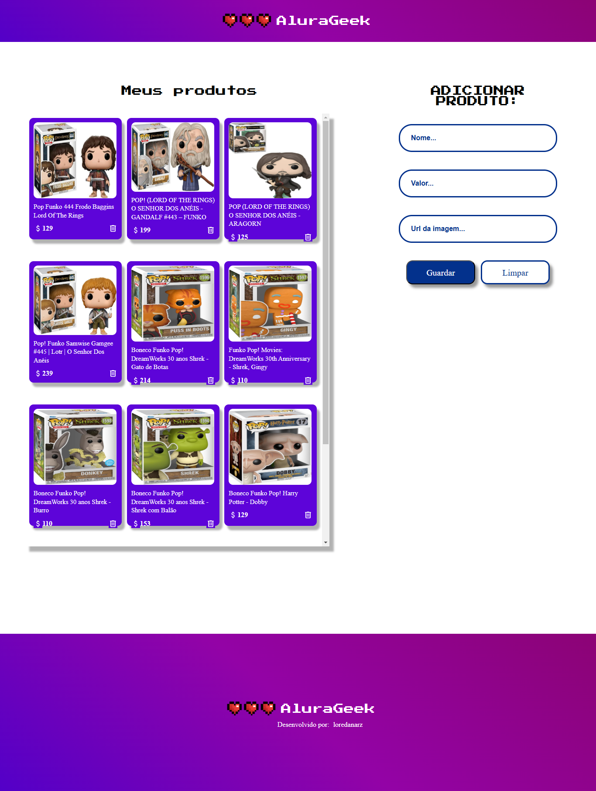

# Challenge--Alura-Geek-Loja-Online
# 🛍️ Sobre o Projeto
Este é um projeto de catálogo de produtos desenvolvido em HTML, CSS e JavaScript, com consumo de uma API local utilizando o JSON Server.

# 📖 Descrição do Projeto
O Catálogo de Produtos exibe uma lista de produtos consumidos de uma API local, permitindo também criar e excluir itens. É uma aplicação simples para demonstrar o consumo de APIs e manipulação do DOM.

# 🚀 Funcionalidades
Visualizar uma lista de produtos.
Adicionar novos produtos via formulário.
Excluir produtos diretamente da interface.

# 🛠️ Tecnologias Utilizadas
- HTML5
- CSS3
- JavaScript (ES6+)
- JSON Server

# 📋 Pré-requisitos
Node.js instalado na máquina.
Gerenciador de pacotes NPM (vem com o Node.js).

# 🧑‍💻 Como Rodar o Projeto Localmente
1. Clone o repositório

2. Instale o JSON Server (npm install -g json-server)

3. Inicie o JSON Server: 
Certifique-se de estar na pasta do projeto onde está o arquivo db.json, e execute:
json-server --watch db.json --port 3001

4. Abra o projeto no navegador (basta abrir o arquivo index.html no navegador ou usar a extensão Live Server no VSCode)

# ⚠️ Aviso Importante

Para visualizar o projeto corretamente, é necessário rodar o JSON Server localmente conforme descrito acima. Sem ele, a aplicação não conseguirá carregar os produtos.

# Página inicial:
## 🎥 Demonstração ao vivo
Link do projeto: https://challenge-alura-geek-loja-online.vercel.app/

## 🖼️ Captura de Tela
Veja o projeto: 

# 🧑‍💻 Contribuições
Contribuições são bem-vindas! Sinta-se à vontade para abrir um pull request com melhorias ou novas ideias.

# 📝 Licença
Este projeto está sob a licença MIT. Consulte o arquivo LICENSE para mais informações.
